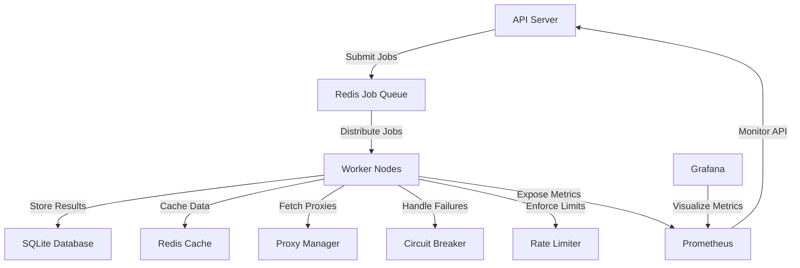

# Web Scraper

A distributed, scalable, and resilient web scraper built in Go. This system is designed for high-volume scraping with built-in monitoring, rate limiting, and fault tolerance.

## Features

- **Distributed Architecture**: Queue-based job processing with Redis
- **Scalability**: Horizontal scaling with worker nodes
- **Resilience**:
  - Circuit breakers for failing domains
  - Automatic retries with exponential backoff
  - Proxy rotation to avoid IP bans
- **Rate Limiting**: Per-host rate limiting to avoid overwhelming servers
- **Monitoring**: Prometheus metrics and Grafana dashboards
- **Storage**:
  - PostgreSQL for persistent storage
  - Redis for caching
- **API**: RESTful API for job management and results retrieval
- **Observability**: Structured logging with Zap
- **Configuration**: Environment variables and config files
- **Beautiful UI**: Modern dashboard to monitor and control the scraper

## Architecture



## Getting Started

### Prerequisites

- Go 1.18 or higher
- Redis server
- SQLite

### Installation

1. **Clone the repository**

```bash
git clone https://github.com/MunishMummadi/web-scrapper.git
cd web-scrapper
```

2. **Set up environment variables**

Copy the example environment file and edit it according to your configuration:

```bash
cp .env.example .env
```

Edit the `.env` file with your specific configuration values.

3. **Install dependencies**

```bash
go mod download
```

4. **Build the application**

```bash
go build -o scraper
```

### Running the Web Scraper

Start the web scraper with:

```bash
./scraper
```

Or with specific configuration:

```bash
./scraper -config=/path/to/config.json
```

Seed a URL to start crawling:

```bash
./scraper -seed=https://example.com
```

Use in-memory queue (for testing without Redis):

```bash
./scraper -mem-queue
```

## Web Interface

The web scraper includes a modern UI accessible at `http://localhost:8080` (or whatever port you configured).

### Dashboard

The dashboard provides an overview of:
- Total pages scraped
- URLs in queue
- Crawl rate
- Error rate
- Charts showing scraping activity and performance

### Data View

View all scraped pages with:
- Sortable and filterable table
- Links to original content
- Content hash information
- Actions to view details or rescrape

### Scraping Interface

Submit new URLs for scraping with options:
- Follow links (crawl mode)
- Stay on same domain
- Set maximum crawl depth
- Configure rate limiting
- Bulk URL submission

### Settings

Configure all aspects of the scraper:
- Queue timeouts and backoff settings
- Circuit breaker parameters
- Rate limiting rules
- Proxy configuration with testing
- User agent rotation

## API Endpoints

| Endpoint | Method | Description |
|----------|--------|-------------|
| `/api/enqueue` | POST | Submit a URL for scraping |
| `/api/data` | GET | Get scraped data as JSON |
| `/api/jobs` | GET | List active scraping jobs |
| `/api/jobs/{id}/pause` | POST | Pause a running job |
| `/api/jobs/{id}/resume` | POST | Resume a paused job |
| `/api/jobs/{id}/cancel` | POST | Cancel a job |
| `/api/settings/{section}` | POST | Update settings |
| `/api/test-proxies` | POST | Test proxy configurations |
| `/health` | GET | Health check endpoint |
| `/metrics` | GET | Prometheus metrics endpoint |

## Performance Tuning

For optimal performance:

1. **Redis Queue Timeout**: 
   - Set to 1 second (instead of 5) to prevent context deadline exceeded errors
   - Configure in the Settings UI or .env file

2. **Worker Timeout**:
   - Also set to 1 second for better error handling
   - Adjust based on your scraping needs

3. **Empty Queue Backoff**:
   - Prevents CPU spinning when the queue is empty
   - Default is 500ms, adjust in Settings UI

4. **Rate Limiting**:
   - Configure per-domain limits to respect website constraints
   - Set global limits based on your infrastructure capacity

## Troubleshooting

Common issues and their solutions:

### Redis Connection Issues

If you encounter Redis connection issues:
- Verify Redis is running: `redis-cli ping`
- Check your Redis configuration in `.env`
- The system will fall back to in-memory queue if Redis is unavailable

### Context Deadline Exceeded

If you see context timeout errors:
- Reduce Redis queue timeout to 1 second (in Settings)
- Reduce worker timeout to 1 second
- Implement backoff when queue is empty

### High CPU Usage

If you notice high CPU usage:
- Check empty queue backoff settings
- Reduce polling frequency
- Adjust the number of worker threads

## Contributing

Contributions are welcome! Please feel free to submit a Pull Request.

1. Fork the repository
2. Create your feature branch (`git checkout -b feature/amazing-feature`)
3. Commit your changes (`git commit -m 'Add some amazing feature'`)
4. Push to the branch (`git push origin feature/amazing-feature`)
5. Open a Pull Request

## License

This project is licensed under the MIT License - see the [LICENSE](LICENSE) file for details.
