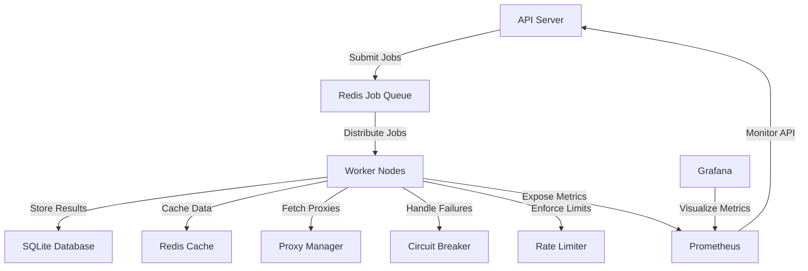

# Web Scraper

A distributed, scalable, and resilient web scraper built in Go. This system is designed for high-volume scraping with built-in monitoring, rate limiting, and fault tolerance.

## Features

- **Distributed Architecture**: Queue-based job processing with Redis
- **Scalability**: Horizontal scaling with worker nodes
- **Resilience**:
  - Circuit breakers for failing domains
  - Automatic retries with exponential backoff
  - Proxy rotation to avoid IP bans
- **Rate Limiting**: Per-host rate limiting to avoid overwhelming servers
- **Monitoring**: Prometheus metrics and Grafana dashboards
- **Storage**:
  - SQLite for persistent storage
  - Redis for caching
- **API**: RESTful API for job management and results retrieval
- **Observability**: Structured logging with Zap
- **Configuration**: Environment variables and config files
- **Simple Dashboard**: Basic web interface to view and submit scraping jobs

## Architecture



## Getting Started

### Prerequisites

- Go 1.18 or higher
- Redis server
- SQLite

### Installation

1. **Clone the repository**

```bash
git clone https://github.com/MunishMummadi/web-scrapper.git
cd web-scrapper
```

2. **Set up environment variables**

Copy the example environment file and edit it according to your configuration:

```bash
cp .env.example .env
```

Edit the `.env` file with your specific configuration values.

3. **Install dependencies**

```bash
go mod download
```

4. **Build the application**

```bash
go build -o scraper
```

### Running the Web Scraper

#### Basic Usage

Start the web scraper with:

```bash
./scraper
```

This will start the web scraper with default settings. The web interface will be available at `http://localhost:8080` (or whatever port you configured in your .env file).

#### Command Line Options

You can provide additional options when starting the scraper:

1. **Specify a seed URL to start crawling immediately**:

```bash
./scraper -seed=https://example.com
```

2. **Use in-memory queue instead of Redis** (useful for testing or when Redis is unavailable):

```bash
./scraper -mem-queue
```

3. **Specify a custom configuration file**:

```bash
./scraper -config=/path/to/config.json
```

#### Using the Web Interface

Once the scraper is running, you can access the web interface at `http://localhost:8080`. The interface allows you to:

1. View the list of scraped pages
2. Submit new URLs for scraping
3. View basic statistics about the scraper

#### Using the API Directly

You can also interact with the scraper's API directly from the terminal:

1. **Submit a URL for scraping**:

```bash
curl -X POST http://localhost:8080/api/enqueue -d "url=https://example.com"
```

2. **Get scraped data as JSON**:

```bash
curl http://localhost:8080/api/data
```

3. **Get scraper statistics**:

```bash
curl http://localhost:8080/api/stats
```

4. **Check health status**:

```bash
curl http://localhost:8080/health
```

## API Endpoints

| Endpoint | Method | Description |
|----------|--------|-------------|
| `/api/enqueue` | POST | Submit a URL for scraping |
| `/api/data` | GET | Get scraped data as JSON |
| `/api/stats` | GET | Get scraper statistics |
| `/api/jobs` | GET | List active scraping jobs |
| `/api/settings` | GET/POST | Get or update settings |
| `/health` | GET | Health check endpoint |
| `/metrics` | GET | Prometheus metrics endpoint |

## Performance Tuning

For optimal performance:

1. **Redis Queue Timeout**: 
   - Set to 1 second (instead of 5) to prevent context deadline exceeded errors
   - Configure in the .env file

2. **Worker Timeout**:
   - Also set to 1 second for better error handling
   - Adjust based on your scraping needs

3. **Empty Queue Backoff**:
   - Prevents CPU spinning when the queue is empty
   - Default is 500ms

4. **Rate Limiting**:
   - Configure per-domain limits to respect website constraints
   - Set global limits based on your infrastructure capacity

## Troubleshooting

Common issues and their solutions:

### Redis Connection Issues

If you encounter Redis connection issues:
- Verify Redis is running: `redis-cli ping`
- Check your Redis configuration in `.env`
- The system will fall back to in-memory queue if Redis is unavailable

### Context Deadline Exceeded

If you see context timeout errors:
- Reduce Redis queue timeout to 1 second
- Reduce worker timeout to 1 second
- Implement backoff when queue is empty

### High CPU Usage

If you notice high CPU usage:
- Check empty queue backoff settings
- Reduce polling frequency
- Adjust the number of worker threads

## License

This project is licensed under the MIT License - see the [LICENSE](LICENSE) file for details.

---

*Crafted with ☕ and 💻 by Munish Mummadi - Web scraping the world, one page at a time!*
