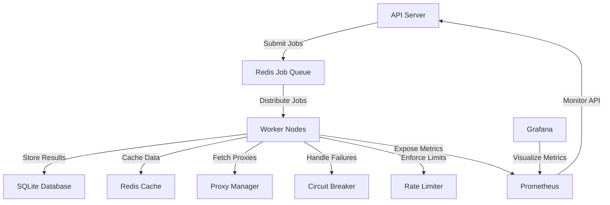

# Web Scraper

A distributed, scalable, and resilient web scraper built in Go. This system is designed for high-volume scraping with built-in monitoring, rate limiting, and fault tolerance.

## Features

- **Distributed Architecture**: Queue-based job processing with Redis
- **Scalability**: Horizontal scaling with worker nodes
- **Resilience**:
  - Circuit breakers for failing domains
  - Automatic retries with exponential backoff
  - Proxy rotation to avoid IP bans
- **Rate Limiting**: Per-host rate limiting to avoid overwhelming servers
- **Monitoring**: Prometheus metrics and Grafana dashboards
- **Storage**:
  - PostgreSQL for persistent storage
  - Redis for caching
- **API**: RESTful API for job management and results retrieval
- **Observability**: Structured logging with Zap
- **Configuration**: Environment variables and config files

## Architecture

